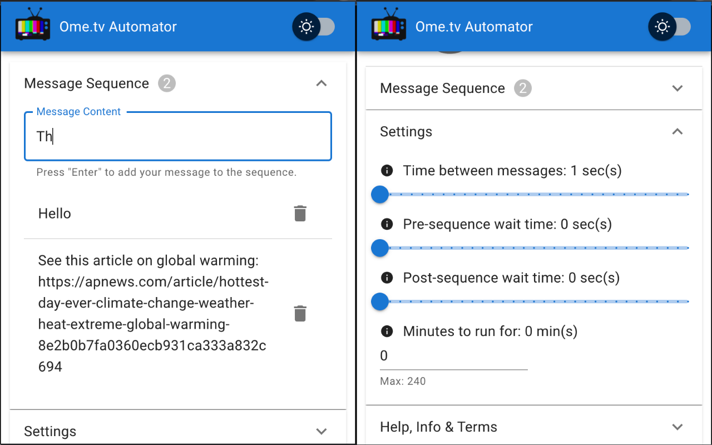

# Ome.tv Automator

Ome.tv Automator automatically sends your messages to thousands of people.

See it on the [Chrome Web Store](https://chromewebstore.google.com/detail/ometv-automator/kdakicmdgfidhnnfjgomlkoikigebpdf).

**Production**:

**Development**:

## Get started

1. Add a message to the sequence (e.g. "Hello"). Multiple messages also supported.
2. Navigate to <https://ome.tv> and click the Ome.tv Automator "Play" button.

You'll notice the Ome.tv "Start" button is automatically clicked. Once you're connected to a stranger, messages from the sequence are sent, in order. Afterwards, "Next" is clicked and the sequence is sent to the next connection, and so on.

## What if a stranger disconnects mid-sequence?

Ome.tv Automator understands when it's disconnected on, and reacts quickly to restart the sequence, once reconnected with someone new.

More information & legal disclaimers available under "Help, Info & Terms" in the Ome.tv Automator popup window

## Screenshots

